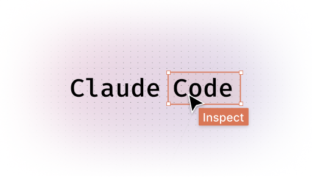

# Claude Code Inspect

<!--suppress HtmlDeprecatedAttribute -->
<p align="center">
  <picture>
    <source media="(prefers-color-scheme: dark)" srcset=".github/banner-dark.png" />
    
  </picture>
</p>

<p align="center">
  <video src="https://github.com/user-attachments/assets/acc7655e-6317-44e0-9b70-a35fabfe6cb3" autoplay loop muted playsinline></video>
</p>

[](LICENSE)
[](package.json)

A browser extension that sends full element context (selector, dimensions, React component name, source file, and screenshot) straight to your active [Claude Code](https://claude.ai/code) session.

Instead of manually copying selectors, pasting screenshots, and describing layouts, you click once and Claude receives everything automatically. No copy-pasting, no context switching, no wasted tokens describing what Claude could just see.

This means faster fixes, more precise answers, and significantly fewer tokens spent on setup. Claude jumps straight to the solution.

### Token-efficient vision

Screenshots are never inlined into the conversation as text. Instead, the plugin stores them server-side and tells Claude a screenshot is available for a given message. Claude calls the `get_screenshot` MCP tool only when it actually needs to look, at which point the image is delivered as a native image block to Claude's vision encoder, not as a base64 string embedded in the prompt.

This means:

- **Zero screenshot tokens** when Claude can answer from the selector and component name alone
- **Vision tokens only when needed** (far cheaper per unit of visual information than text tokens)
- **No context bloat** (the conversation stays clean regardless of how many elements you inspect)

## How to use

1. Install the extension from the Chrome Web Store _(link coming soon)_
2. Start Claude Code with the plugin:
   ```bash
   claude --channels plugin:claude-code-inspect@github/digital-flowers/claude-code-inspect
   ```
3. Open any webpage, click the **Claude Code Inspect** icon in your toolbar
4. Click **Inspect**, then click any element on the page
5. Type your question in the chat box and press **Enter**

Claude Code receives your question with full element context (selector, dimensions, React component name, source file, domain name, and a screenshot) and responds directly in the terminal.

> If the extension shows a red "Disconnected" indicator in the header, copy the command shown and run it in your terminal.

---

## How it works

The extension captures element details (selector, dimensions, React component info, screenshot) and sends them alongside your question to an active Claude Code session. Claude sees the full context and can help with styling, debugging, accessibility, or anything else about the element.

```
Browser Extension  ->  POST localhost:9999  ->  MCP Channel Server  ->  Claude Code session
                                                       |
                                               screenshot store
                                           (keyed by message_id,
                                            fetched on demand via
                                            get_screenshot tool)
```

Claude Code spawns `server.ts` automatically as a subprocess when started with `--channels`. The server listens on `localhost:9999` for messages from the extension and forwards them into the session via `notifications/claude/channel`.

## Monorepo structure

```
claude-code-inspect/
├── apps/
│   ├── extension/      # Chrome extension (React + TypeScript + Vite)
│   └── plugin/         # MCP channel server (Node + TypeScript)
│       └── .claude-plugin/
│           └── plugin.json   # Tells Claude Code how to spawn the server
└── package.json        # npm workspace root
```

---

## Prerequisites

| Tool                                  | Version  | Required for          |
|---------------------------------------|----------|-----------------------|
| Node.js + npx                         | 18+      | Running the plugin    |
| [Claude Code](https://claude.ai/code) | v2.1.80+ | Receiving messages    |
| Chrome / Chromium                     | 120+     | Loading the extension |

---

## Setup

### 1. Install the Chrome extension

Install from the Chrome Web Store _(link coming soon)_.

### 2. Start Claude Code with the plugin

```bash
claude --channels plugin:claude-code-inspect@github/digital-flowers/claude-code-inspect
```

Claude Code fetches the plugin from GitHub, spawns `server.ts` as a subprocess, and the HTTP listener starts automatically on port 9999. When the extension detects it, the header turns green.

---

## Usage

1. Open any webpage and click the **Claude Code Inspect** icon to open the side panel
2. Click **Inspect**, then click any element on the page
3. The element's details appear in the panel (selector, size, React component, screenshot)
4. Type a question in the chat box and press **Enter**
5. Your question, with element context attached, lands in your Claude Code session

### Connection status

The header shows the connection state at a glance:

| State           | Meaning                                  |
|-----------------|------------------------------------------|
| 🟢 Connected    | Ready to send                            |
| 🔴 Disconnected | Start Claude Code with the command shown |

---

## Local testing (without publishing)

### 1. Build and load the extension

```bash
npm run build
```

Then load `apps/extension/dist/` as an unpacked extension in Chrome (`chrome://extensions` -> Developer mode -> Load unpacked).

### 2. Test the bridge in isolation

Start the plugin standalone and verify the HTTP server is working before involving Claude Code:

```bash
# Terminal 1 - start the plugin
cd apps/plugin && npx tsx server.ts

# Terminal 2 - health check
curl http://localhost:9999/health

# Terminal 3 - send a test message
curl -X POST http://localhost:9999/message \
  -H 'Content-Type: application/json' \
  -d '{"content":"hello from test","context":{"tagName":"div","htmlPath":"#root > div","boundingRect":{"width":100,"height":50},"url":"https://example.com"}}'
```

### 3. Run the full end-to-end flow

```bash
claude --plugin-dir /path/to/claude-code-inspect/apps/plugin --dangerously-load-development-channels plugin:claude-code-inspect@inline
```

Then open Chrome, inspect an element in the extension, type a message, and it should appear in the Claude Code terminal.

### 4. Watch mode (simultaneous development)

```bash
# Terminal 1 - rebuild extension on save
npm run dev

# Terminal 2 - Claude Code with channel server (auto-restarts server.ts on change)
claude --plugin-dir /path/to/claude-code-inspect/apps/plugin --dangerously-load-development-channels plugin:claude-code-inspect@inline
```

Reload the unpacked extension in Chrome after the extension rebuilds (`chrome://extensions` -> refresh icon).

---

## Development

### Extension (watch mode)

```bash
npm run dev
```

Rebuilds `apps/extension/dist/` on every file change. Reload the extension in Chrome after each build (`chrome://extensions` -> refresh icon).

### Plugin (watch mode)

```bash
cd apps/plugin
bun run dev
```

Restarts the bridge server on every change to `server.ts`.

### Type checking

```bash
npm run typecheck   # extension
cd apps/plugin && bun run typecheck   # plugin
```

### Lint

```bash
npm run lint         # check
npm run lint:fix     # auto-fix
```

---

## How the plugin works

The plugin (`apps/plugin/server.ts`) is a Node process that does two things simultaneously:

- **MCP server over stdio**: Claude Code spawns it as a subprocess via `.claude-plugin/plugin.json` and communicates over stdin/stdout. The `claude/channel` experimental capability tells Claude Code to register a notification listener for incoming events.
- **HTTP server on `localhost:9999`**: accepts `POST /message` from the extension and forwards to Claude Code via `notifications/claude/channel`; exposes `GET /health` for the extension's connection polling.

The port defaults to `9999` and can be changed via the `BRIDGE_PORT` environment variable.

### Screenshot delivery

When a message arrives with a screenshot, the plugin:

1. Strips the `data:` URI prefix and stores the raw base64 in an in-memory map keyed by `message_id`
2. Sends a channel notification with a text hint instead of the image data:
   ```
   screenshot: available, call get_screenshot('<message_id>') to view it
   ```
3. Exposes a `get_screenshot` MCP tool that returns a native `image` content block when called

Claude's vision encoder receives the image directly. It is never serialized into the text context. Screenshots that Claude doesn't need (answerable from selector/component info alone) cost zero tokens.

Channel notifications delivered to Claude Code look like:

```
<channel source="claude-code-inspect" chat_id="browser" ...>
  Why is this button not aligning correctly?

  ---
  url: https://example.com
  html: #root > main > .actions > button
  react: <SubmitButton />
  src: src/components/SubmitButton.tsx:42
  screenshot: available, call get_screenshot('abc-123') to view it
</channel>
```

---

## Project scripts

| Command                               | What it does                       |
|---------------------------------------|------------------------------------|
| `npm run build`                       | Build the extension for production |
| `npm run dev`                         | Build the extension in watch mode  |
| `npm run typecheck`                   | Type-check the extension           |
| `npm run lint`                        | Lint the extension                 |
| `npm run clean`                       | Remove `apps/extension/dist/`      |
| `cd apps/plugin && npx tsx server.ts` | Run the plugin once                |

---

## Tech stack

**Extension** – React 19, TypeScript, Tailwind CSS 4, Vite 8, Manifest V3  
**Plugin** – Node.js, TypeScript, `@modelcontextprotocol/sdk`  
**Monorepo** - npm workspaces  
**License** – [Elastic License 2.0](LICENSE) – free to use and contribute; redistribution as a competing product is not permitted
